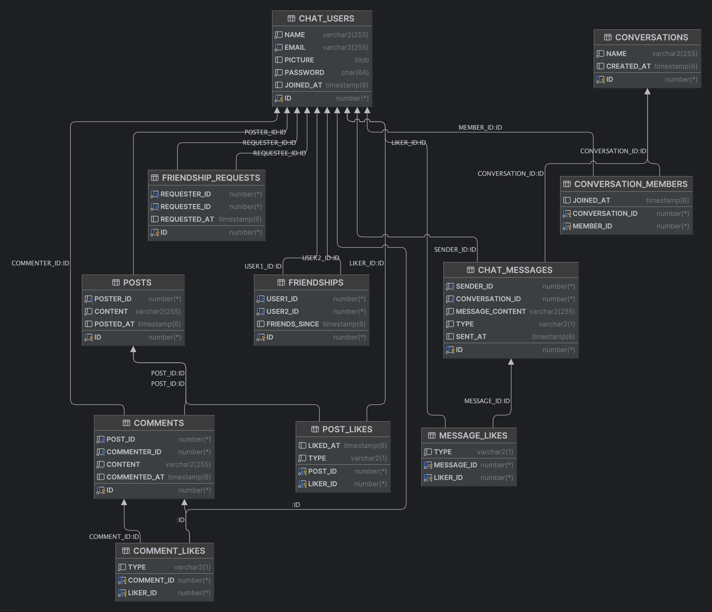
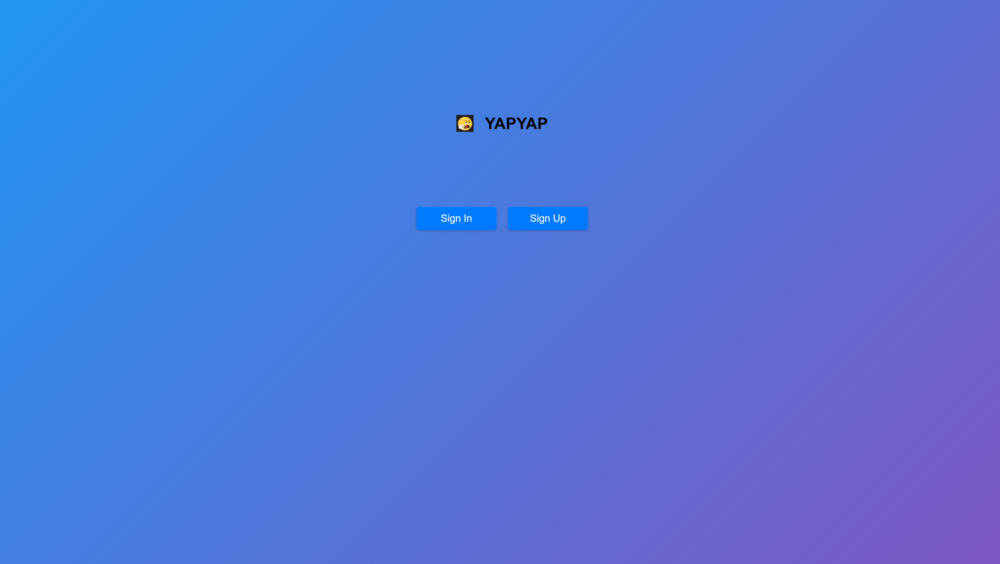
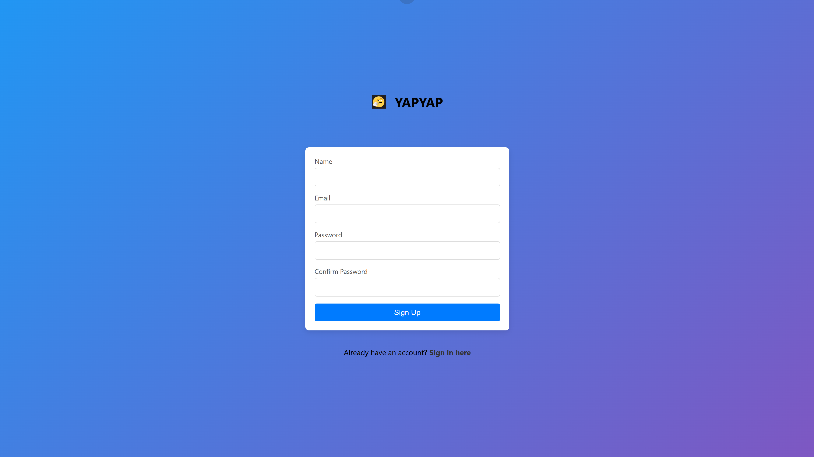
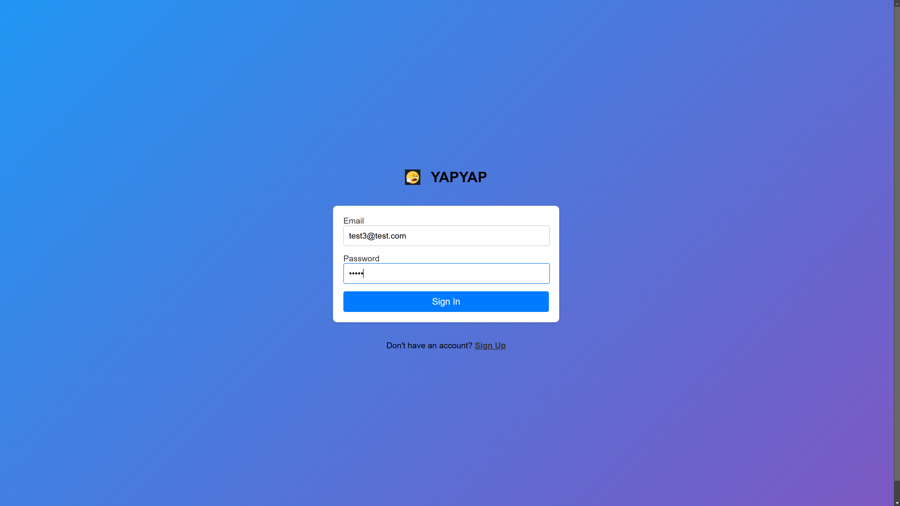
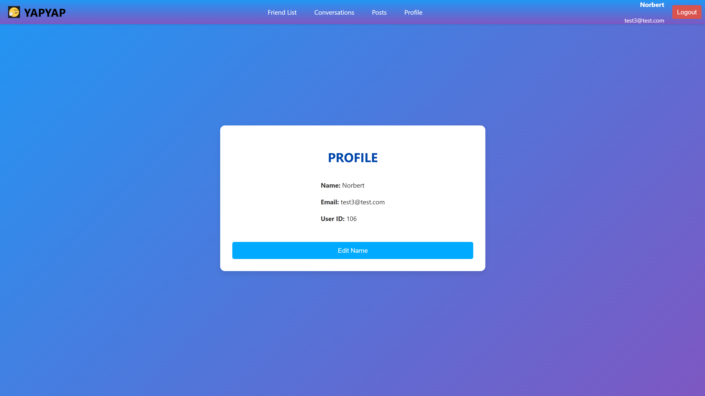
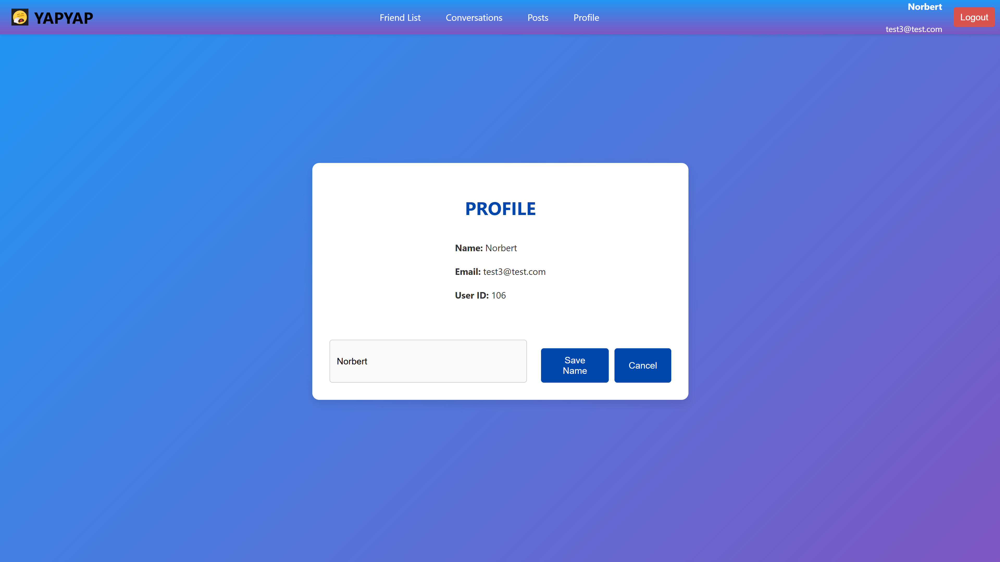
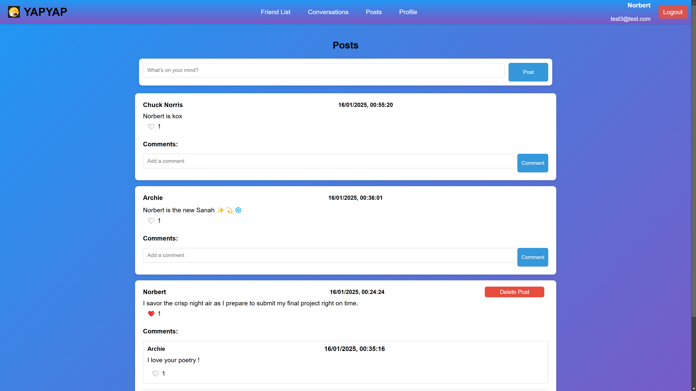
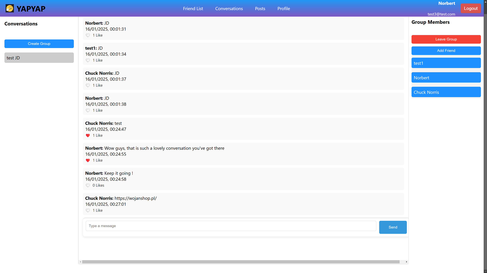
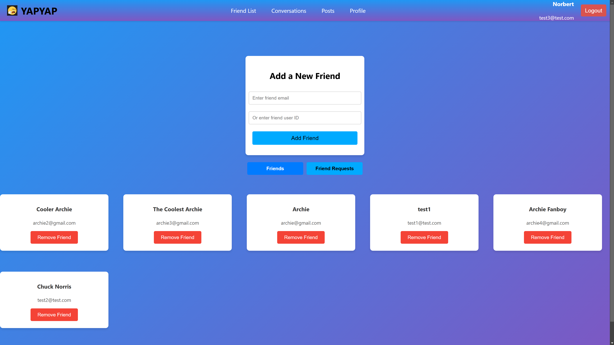

## Instrukcja uruchomienia projektu

Należy skopiować poniższe polecenia i uruchomić je w terminalu:

```bash
git clone https://github.com/PhoXinuS/YapYap-Communicator.git
cd pap2024z-z06
docker compose build #wymagany docker do uruchomiena projektu
docker compose up
```
Po wykonaniu komend uruchom należy przejść w przeglądarce pod link: http://localhost/

## Skład zespołu:
-   Dominik Śledziewski
-   Jan Szwagierczak
-   Piotr Szkoda
-   Tomasz Okoń

# Dokumentacja Wstępna - Komunikator Tekstowy
## Opis Projektu
Aplikacja Komunikator Tekstowy umożliwia użytkownikom wymianę wiadomości w czasie rzeczywistym. Dzięki wykorzystaniu technologii WebSocket, komunikacja odbywa się bez opóźnień, co pozwala na natychmiastowe przeglądanie i wysyłanie wiadomości.

## Funkcjonalności
-   Rejestracja ✅
-   Logowanie ✅

-   Wyświetlanie informacji o użytkowniku ✅
-   Edytowanie nazwy ✅

-   Wyświetlanie listy konwersacji ✅
-   Tworzenie konwersacji (w tym grupowych) ✅
-   Rozszerzanie konwersacji ✅
-   Opuszczanie konwersacji ✅
-   Wyświetlanie członków konwersacji ✅
-   Wysyłanie wiadomości ✅
-   Odbieranie wiadomości ✅
-   Reakcje na wiadomości - like ✅

-   Wyświetlanie listy znajomych ✅
-   Usuwanie znajomych ✅
-   Wysyłanie zaproszeń do znajomych po mailu/id ✅
-   Akceptowanie/odrzucanie zaproszeń ✅

-   Możliwość postowania (tak jak na facebooku) ✅
-   Możliwość komentowania postów ✅
-   Możliwość reakcji na posta - like ✅
-   Możliwość usuwania postów ✅

# Stack Technologiczny

## Frontend
### Framework: React.js
- **Podstawa**: Biblioteka do tworzenia interfejsu użytkownika
- **Stan aplikacji**:
  - Context API
  - React Hooks
- **Routing**: React Router
- **WebSocket**: STOMP over SockJS client
- **HTTP Client**: Axios
- **Port deweloperski**: 3000

## Backend
### Framework: Spring Boot (Java)
- **Bezpieczeństwo**: Spring Security z JWT
- **API**: Spring Web (REST)
- **WebSocket**:
  - Protokół: STOMP
  - Fallback: SockJS
  - Broker: Simple Broker
  - Endpoint: `/ws`

## Baza Danych
### Oracle Database
- **ORM**: JPA/Hibernate
- **Połączenie**: JDBC
- **Zapytania**: Natywne SQL

## Narzędzia Deweloperskie
- **Konteneryzacja**: Docker
- **Kontrola wersji**: Git
- **CI/CD**: GitLab, DigitalOcean
- **Zarządzanie pakietami**:
  - Frontend: npm/yarn
  - Backend: Maven

## Architektura
- **Wzorzec**: MVC
- **Komunikacja**:
  - REST API
  - WebSocket (real-time)
- **Autoryzacja**: JWT


## Podział ról
-   Dominik - backend
-   Piotr - CI/CD, serwer
-   Tomasz - frontend i baza danych
-   Jan - testy

## Wstępna baza danych



## Wstępny projekt UI

### Strona główna

### Panel rejestracji

### Panel logowania

### Profil

### Edycja nazwy

### Posty

### Konwersacje

### Lista znajomych


